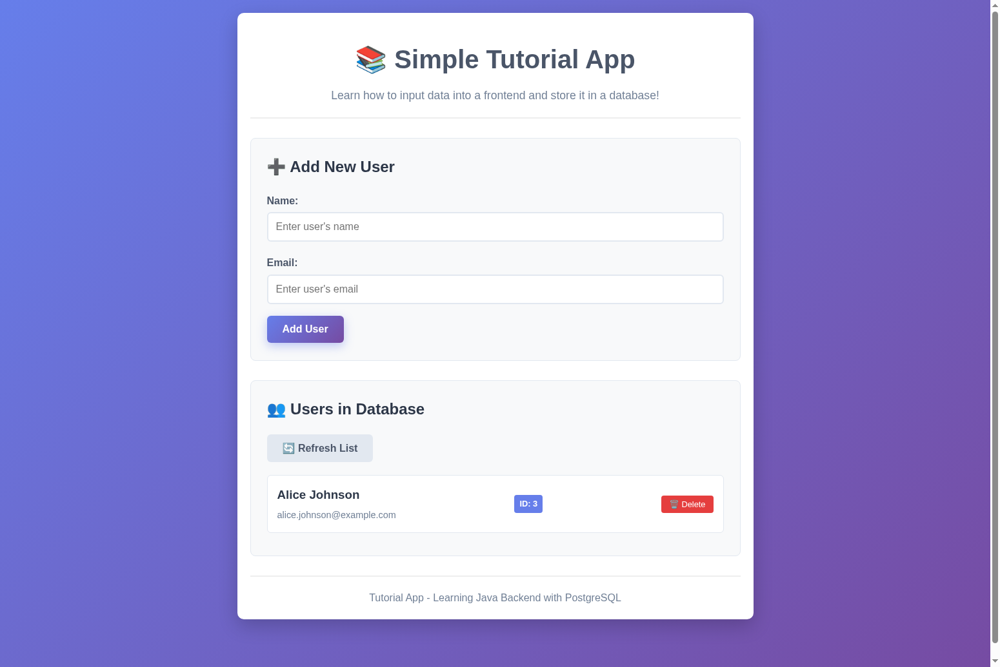

# 📚 Simple Java Tutorial App

A beginner-friendly tutorial application that demonstrates how to create a full-stack web application with:
- **Frontend**: Simple HTML/CSS/JavaScript
- **Backend**: Java with Spring Boot
- **Database**: PostgreSQL

This app allows you to add users through a web form and see them stored in a PostgreSQL database.

## 🌐 Live Demo

**[🚀 Visit Simple Java Tutorial App](http://localhost:3000)**



## 📋 What You'll Learn

- How to create a REST API with Java Spring Boot
- How to connect Java to a PostgreSQL database
- How to create a simple frontend that communicates with a backend
- How to handle form submissions and display data
- Basic CRUD operations (Create, Read, Delete)

## 🛠️ Prerequisites

Before running this application, make sure you have the following installed:

### Required Software:
1. **Java 11 or higher**
   - Download from: https://adoptium.net/
   - Check if installed: `java -version`

2. **Maven 3.6 or higher**
   - Download from: https://maven.apache.org/download.cgi
   - Check if installed: `mvn -version`

3. **PostgreSQL 12 or higher**
   - Download from: https://www.postgresql.org/download/
   - Check if installed: `psql --version`

4. **Python 3** (for running the frontend)
   - Usually pre-installed on Mac/Linux
   - Windows: Download from https://python.org
   - Check if installed: `python3 --version`

## 🗄️ Database Setup

### Step 1: Start PostgreSQL Service

**On Windows:**
```bash
# Start PostgreSQL service
net start postgresql-x64-14
```

**On Mac (with Homebrew):**
```bash
# Start PostgreSQL service
brew services start postgresql
```

**On Linux (Ubuntu/Debian):**
```bash
# Start PostgreSQL service
sudo systemctl start postgresql
sudo systemctl enable postgresql
```

### Step 2: Create Database and User

Open your terminal and connect to PostgreSQL:

```bash
# Connect to PostgreSQL as superuser
sudo -u postgres psql

# Or on Windows/Mac:
psql -U postgres
```

Once connected to PostgreSQL, run these commands:

```sql
-- Create a new database for our tutorial
CREATE DATABASE tutorial_db;

-- Create a new user for our application
CREATE USER tutorial_user WITH PASSWORD 'tutorial_password';

-- Grant all privileges on the database to our user
GRANT ALL PRIVILEGES ON DATABASE tutorial_db TO tutorial_user;

-- Exit PostgreSQL
\q
```

### Step 3: Verify Database Connection

Test that you can connect with the new user:

```bash
psql -h localhost -U tutorial_user -d tutorial_db
```

Enter the password `tutorial_password` when prompted. If successful, you'll see the PostgreSQL prompt.

## 🚀 Running the Application

### Step 1: Clone/Download the Project

If you haven't already, make sure you have all the project files in a folder called `java-tutorial-app`.

### Step 2: Start the Backend (Java Spring Boot)

Open a terminal and navigate to the backend directory:

```bash
cd java-tutorial-app/backend
```

Install dependencies and start the backend server:

```bash
# Install dependencies and compile the project
mvn clean install

# Start the backend server
mvn spring-boot:run
```

You should see output like:
```
🚀 Backend server is running on http://localhost:8080
```

**Keep this terminal open** - the backend server needs to keep running.

### Step 3: Start the Frontend

Open a **new terminal** and navigate to the frontend directory:

```bash
cd java-tutorial-app/frontend/public
```

Start the frontend server:

```bash
# Start the frontend server
python3 -m http.server 3000
```

You should see output like:
```
Serving HTTP on 0.0.0.0 port 3000 (http://0.0.0.0:3000/) ...
```

### Step 4: Open the Application

Open your web browser and go to:
```
http://localhost:3000
```

You should see the Simple Tutorial App interface!

## 🎯 How to Use the App

1. **Add a User**: 
   - Fill in the "Name" and "Email" fields
   - Click "Add User"
   - You should see a success message

2. **View Users**: 
   - All users are automatically displayed below the form
   - Each user shows their ID, name, and email

3. **Delete a User**: 
   - Click the "🗑️ Delete" button next to any user
   - Confirm the deletion in the popup

4. **Refresh the List**: 
   - Click "🔄 Refresh List" to reload users from the database

## 🔧 Troubleshooting

### Backend Won't Start

**Problem**: `Connection refused` or database errors

**Solution**: 
1. Make sure PostgreSQL is running: `sudo systemctl status postgresql`
2. Check database credentials in `backend/src/main/resources/application.properties`
3. Verify you can connect manually: `psql -h localhost -U tutorial_user -d tutorial_db`

### Frontend Can't Connect to Backend

**Problem**: "Error connecting to server" messages

**Solution**:
1. Make sure the backend is running on port 8080
2. Check the browser console for CORS errors
3. Verify the API URL in `frontend/public/script.js` is correct

### Port Already in Use

**Problem**: `Port 8080 is already in use`

**Solution**:
1. Kill the process using the port: `lsof -ti:8080 | xargs kill -9`
2. Or change the port in `application.properties`: `server.port=8081`

### Maven Build Fails

**Problem**: Maven can't download dependencies

**Solution**:
1. Check your internet connection
2. Clear Maven cache: `mvn clean`
3. Try: `mvn dependency:resolve`

## 📁 Project Structure

```
java-tutorial-app/
├── backend/                          # Java Spring Boot backend
│   ├── src/main/java/com/tutorial/
│   │   ├── Application.java          # Main application entry point
│   │   ├── User.java                 # User entity (database model)
│   │   ├── UserRepository.java       # Database operations interface
│   │   └── UserController.java       # REST API endpoints
│   ├── src/main/resources/
│   │   └── application.properties    # Database and server configuration
│   └── pom.xml                       # Maven dependencies and build config
├── frontend/                         # Simple HTML/CSS/JS frontend
│   ├── public/
│   │   ├── index.html               # Main HTML page
│   │   ├── styles.css               # CSS styling
│   │   └── script.js                # JavaScript for API calls
│   └── package.json                 # Frontend project info
└── README.md                        # This file
```

## 🎓 Learning Points

### Backend (Java Spring Boot):

1. **Application.java**: Entry point that starts the Spring Boot server
2. **User.java**: Entity class that maps to database table
3. **UserRepository.java**: Interface for database operations (Spring Data JPA)
4. **UserController.java**: REST API endpoints that handle HTTP requests
5. **application.properties**: Configuration for database connection

### Frontend (HTML/CSS/JavaScript):

1. **index.html**: Structure of the web page
2. **styles.css**: Styling and layout
3. **script.js**: JavaScript that makes API calls to the backend

### Database (PostgreSQL):

1. **Automatic table creation**: Spring Boot creates the `users` table automatically
2. **CRUD operations**: Create, Read, Delete operations through the API
3. **Data persistence**: Data is stored permanently in PostgreSQL

## 🔄 API Endpoints

The backend provides these REST API endpoints:

- `GET /api/users` - Get all users
- `POST /api/users` - Create a new user
- `GET /api/users/{id}` - Get a specific user by ID
- `DELETE /api/users/{id}` - Delete a user by ID

## 🎨 Customization Ideas

Once you understand the basics, try these modifications:

1. **Add more fields**: Add age, phone number, or address to the User entity
2. **Add validation**: Implement email format validation
3. **Add search**: Create an endpoint to search users by name
4. **Improve UI**: Add more styling or use a CSS framework
5. **Add editing**: Implement user update functionality

## 📚 Next Steps

After completing this tutorial, you might want to learn:

1. **Spring Security**: Add authentication and authorization
2. **Frontend Frameworks**: Try React, Vue, or Angular instead of vanilla JavaScript
3. **Testing**: Write unit tests for your backend
4. **Deployment**: Deploy your app to cloud platforms like Heroku or AWS
5. **Advanced Database**: Learn about relationships, indexes, and migrations

## 🆘 Getting Help

If you run into issues:

1. Check the console output for error messages
2. Look at the browser's developer console (F12)
3. Verify all services are running (PostgreSQL, backend, frontend)
4. Check that all ports are available (5432 for PostgreSQL, 8080 for backend, 3000 for frontend)

## 📄 License

This project is for educational purposes. Feel free to use and modify as needed for learning!

---

**Happy Learning! 🎉**
